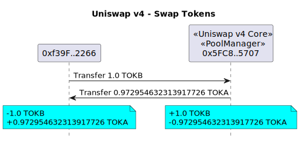
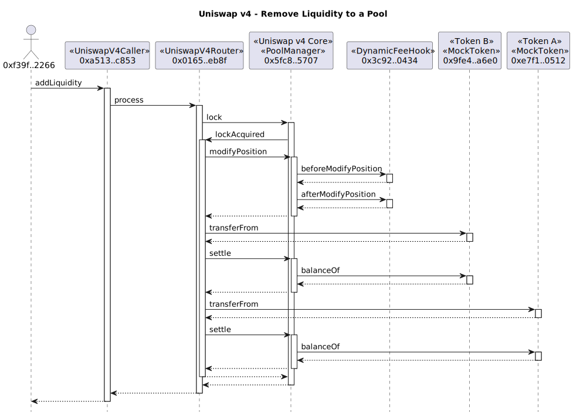
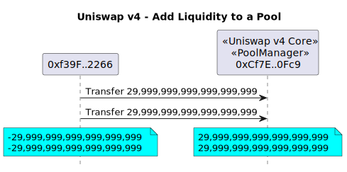
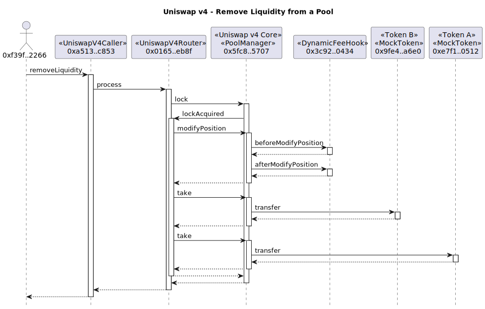
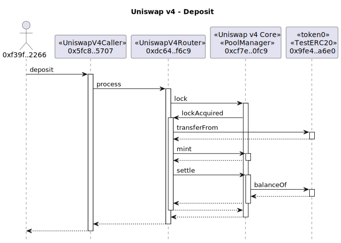
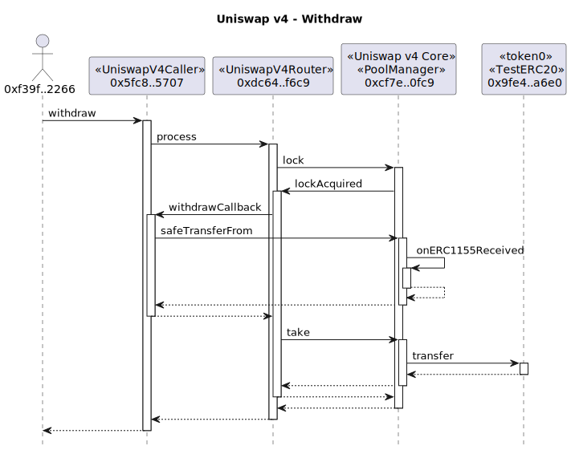
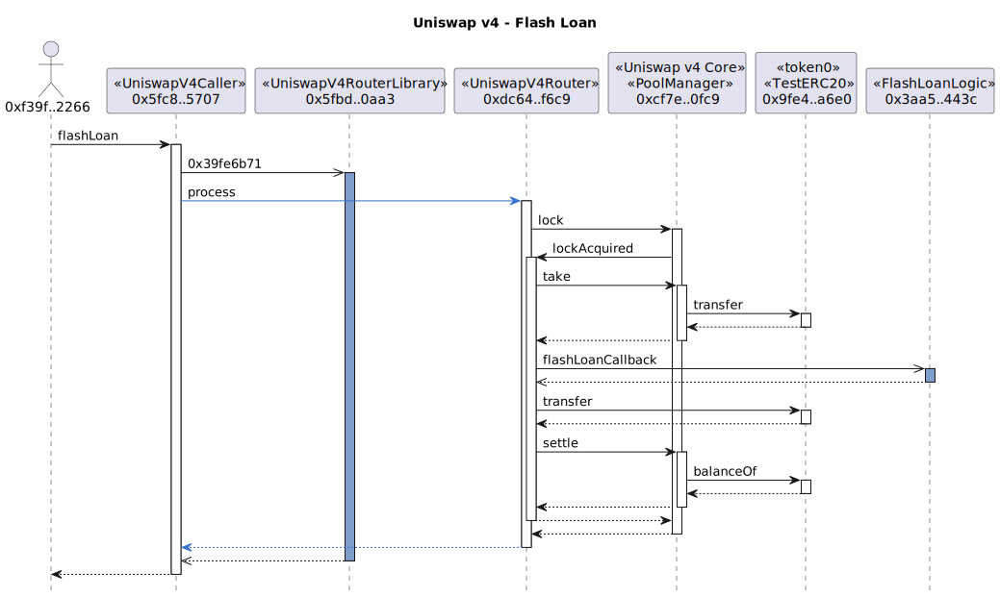
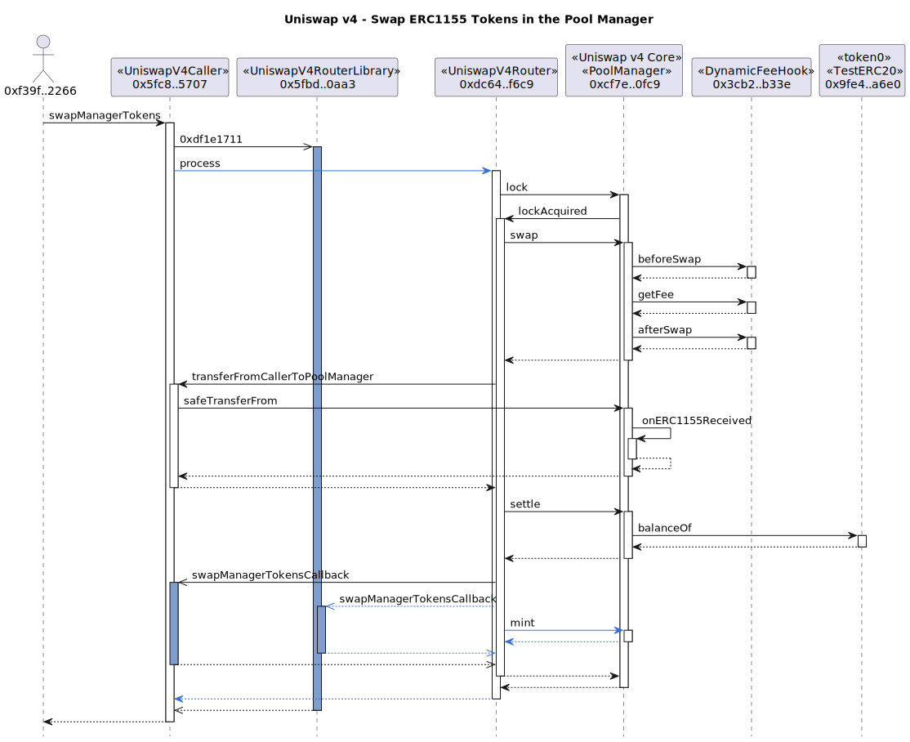

# Example Uniswap v4 Transactions

## Counter Hook

### CounterHook Contract


```
sol2uml class ../src,../lib -b CounterHook
```

### Pool Setup

Deploy a `CounterHook` contract via the `CounterFactory` and initialize a new Uniswap v4 pool using the hook.


```
tx2uml --nodeType anvil --configFile counter.config.json --chain none -hf -hc -g -t -v \
    --title "Uniswap v4 - Pool Setup" \
    --noAddresses 0x000000000000000000636f6e736f6c652e6c6f67 \
    0xfabb35401132c449e2ef6887892d1e2f43e62480e9f1932aa6c7e8308be7eba5,0xb3ee845923d8f202dd8d4326e87c39d7ee00d2ba341c7794d0f392327ecc41ff \
    -o counterSetup
```

### Add Liquidity to Pool


```
tx2uml --nodeType anvil --configFile counter.config.json --chain none  -hf -hc -p -l -x -g -t -v \
    --title "Uniswap v4 - Add Liquidity to Pool" \
    0xd2d9bcee460447a53dc4fcaed32cf121dcd3cbe730871bbb6d2092913f458145 \
    -o counterModifySummary
```

See the full trace with parameters in [counterModifyDetailed.svg](./counterModifyDetailed.svg)

```
tx2uml --nodeType anvil --configFile counter.config.json --chain none -v \
    --title "Uniswap v4 - Add Liquidity to Pool" \
    0xd2d9bcee460447a53dc4fcaed32cf121dcd3cbe730871bbb6d2092913f458145 \
    -o counterModifyDetailed
```

### Swap


```
tx2uml --nodeType anvil --configFile counter.config.json --chain none \
    --title "Uniswap v4 - Swap token0 for token1" -hf -hc -x -l -p -g -t -v \
    0x6e9c7e4cc12cc0719afa739b776bf95e592146622f2dd755c84c81ff98fd706f \
    -o counterSwapSummary
```

See the full trace with parameters in [counterSwapDetailed.svg](./counterSwapDetailed.svg)

```
tx2uml --nodeType anvil --configFile counter.config.json --chain none \
    --title "Uniswap v4 - Swap token0 for token1" -v \
    0x6e9c7e4cc12cc0719afa739b776bf95e592146622f2dd755c84c81ff98fd706f \
    -o counterSwapDetailed
```

## DynamicFeeHook


```
sol2uml class ../src,../lib -b DynamicFeeHook
```

### Swap tokens using a pool


```
tx2uml --nodeType anvil --configFile dynamicFee.config.json --chain none \
    --title "Uniswap v4 - Swap Tokens" -hf -hc -x -l -p -g -t -v \
    0x69d3d0d13de8607fc93e9272e2b976b89847ff04567bc4e4afb36072393157ce \
    -o dynamicFeeSwapSummary
```

See the full trace with parameters in [dynamicFeeSwapDetailed.svg](./dynamicFeeSwapDetailed.svg)

```
tx2uml --nodeType anvil --configFile dynamicFee.config.json --chain none \
    --title "Uniswap v4 - Swap Tokens" -v \
    0x69d3d0d13de8607fc93e9272e2b976b89847ff04567bc4e4afb36072393157ce \
    -o dynamicFeeSwapDetailed
```



```
tx2uml value --configFile dynamicFee.config.json --chain none --onlyToken \
    --title "Uniswap v4 - Swap Tokens" -hf -hc -v \
    0x69d3d0d13de8607fc93e9272e2b976b89847ff04567bc4e4afb36072393157ce \
    -o dynamicFeeSwapValue
```

### Add liquidity to a pool



```
tx2uml --nodeType anvil --configFile dynamicFee.config.json --chain none \
    --title "Uniswap v4 - Remove Liquidity to a Pool" -hf -hc -x -l -p -g -t -v \
    0xbcb9c4367770889f2ecd8e462c5705c42aed5e75c3fbde906962d837154009ba \
    -o dynamicFeeAddSummary
```

See the full trace with parameters in [dynamicFeeAddDetailed](./dynamicFeeAddDetailed.svg)

```
tx2uml --nodeType anvil --configFile dynamicFee.config.json --chain none -g -t -v \
    --title "Uniswap v4 - Add Liquidity to a Pool" -v \
    0xbcb9c4367770889f2ecd8e462c5705c42aed5e75c3fbde906962d837154009ba \
    -o dynamicFeeAddDetailed
```

**Value Flow**



```
tx2uml value --configFile dynamicFee.config.json --chain none --onlyToken \
    --title "Uniswap v4 - Add Liquidity to a Pool" -hf -hc -v \
    0xbcb9c4367770889f2ecd8e462c5705c42aed5e75c3fbde906962d837154009ba \
    -o dynamicFeeAddValue
```

### Remove liquidity from a pool



```
tx2uml --nodeType anvil --configFile dynamicFee.config.json --chain none \
    --title "Uniswap v4 - Remove Liquidity from a Pool" -hf -hc -x -l -p -g -t -v \
    0x96b06d70ad4ffdfd685ea2db7262120531ea144b2a2449c51d8cd85559b37cd3 -o dynamicFeeRemoveSummary
```

See the full trace with parameters in [dynamicFeeRemoveDetailed.svg](./dynamicFeeRemoveDetailed.svg)

```
tx2uml --nodeType anvil --configFile dynamicFee.config.json --chain none \
    --title "Uniswap v4 - Remove Liquidity from a Pool" -v \
    0x96b06d70ad4ffdfd685ea2db7262120531ea144b2a2449c51d8cd85559b37cd3 \
    -o dynamicFeeRemoveDetailed
```

## Pool Manager

## Deposit tokens into the Pool Manager



```
tx2uml --nodeType anvil --configFile dynamicFee.config.json --chain none \
    --title "Uniswap v4 - Deposit" -hf -hc -x -l -p -g -t -v \
    0xf60a246c192bdbd214622dcee34e068b05ee1b553c6ee20ed08b4f154065d44f \
    -o depositSummary
```

See the full trace with parameters in [depositDetailed.svg](./depositDetailed.svg)

```
tx2uml --nodeType anvil --configFile dynamicFee.config.json --chain none \
    --title "Uniswap v4 - Deposit" -v \
    0xf60a246c192bdbd214622dcee34e068b05ee1b553c6ee20ed08b4f154065d44f \
    -o depositDetailed
```

## Withdraw tokens from the Pool Manager



```
tx2uml --nodeType anvil --configFile dynamicFee.config.json --chain none \
    --title "Uniswap v4 - Withdraw" -hf -hc -x -l -p -g -t -v \
    0x6c83adb06d0b985619cb1b37cabd5f012822b7bc2eb9a46dbbf34f85296a5543 \
    -o withdrawSummary
```

See the full trace with parameters in [withdrawDetailed.svg](./withdrawDetailed.svg)

```
tx2uml --nodeType anvil --configFile dynamicFee.config.json --chain none \
    --title "Uniswap v4 - Withdraw" -v \
    0x81ef52fae7c0a4d2421c1caf2d018f45e6ef9c1c0c3a5a13b39a90b8445c8baa,0x6c83adb06d0b985619cb1b37cabd5f012822b7bc2eb9a46dbbf34f85296a5543 \
    -o withdrawDetailed
```

## Flash loan from the Pool Manager



```
tx2uml --nodeType anvil --configFile dynamicFee.config.json --chain none \
    --title "Uniswap v4 - Flash Loan" -hf -hc -l -p -g -t -v \
    0x78b6c2fc358b9bbac59abf59ff850359c68d4bdf59e2601d6499f978829470fa \
    -o flashLoanSummary
```

See the full trace with parameters in [flashLoanDetailed.svg](./flashLoanDetailed.svg)

```
tx2uml --nodeType anvil --configFile dynamicFee.config.json --chain none \
    --title "Uniswap v4 - Flash Loan" -v \
    0x78b6c2fc358b9bbac59abf59ff850359c68d4bdf59e2601d6499f978829470fa \
    -o flashLoanDetailed
```

## Swap tokens (ERC1155) in the Pool Manager tokens



```
tx2uml --nodeType anvil --configFile dynamicFee.config.json --chain none \
    --title "Uniswap v4 - Swap ERC1155 Tokens in the Pool Manager" -hf -hc -x -l -p -g -t -v \
    0xe896d1315f0f24fc94677ec4c7ffed32a25cc389fad38daa53ab7f91a8baa13f \
    -o swapPoolManagerTokensSummary
```

See the full trace with parameters in [swapPoolManagerTokensDetailed.svg](./swapPoolManagerTokensDetailed.svg)

```
tx2uml --nodeType anvil --configFile dynamicFee.config.json --chain none \
    --title "Uniswap v4 - Swap ERC1155 Tokens in the Pool Manager" -v \
    0xe896d1315f0f24fc94677ec4c7ffed32a25cc389fad38daa53ab7f91a8baa13f \
    -o swapPoolManagerTokensDetailed
```
