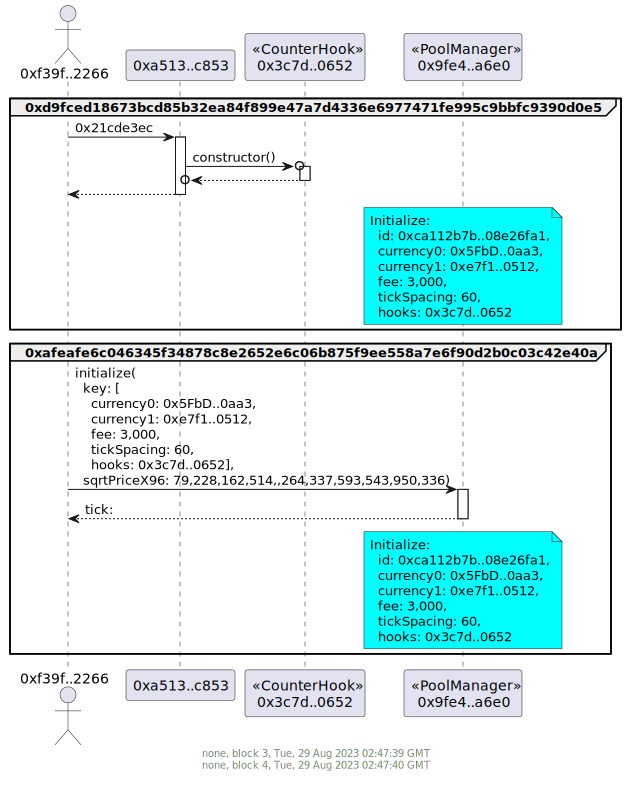
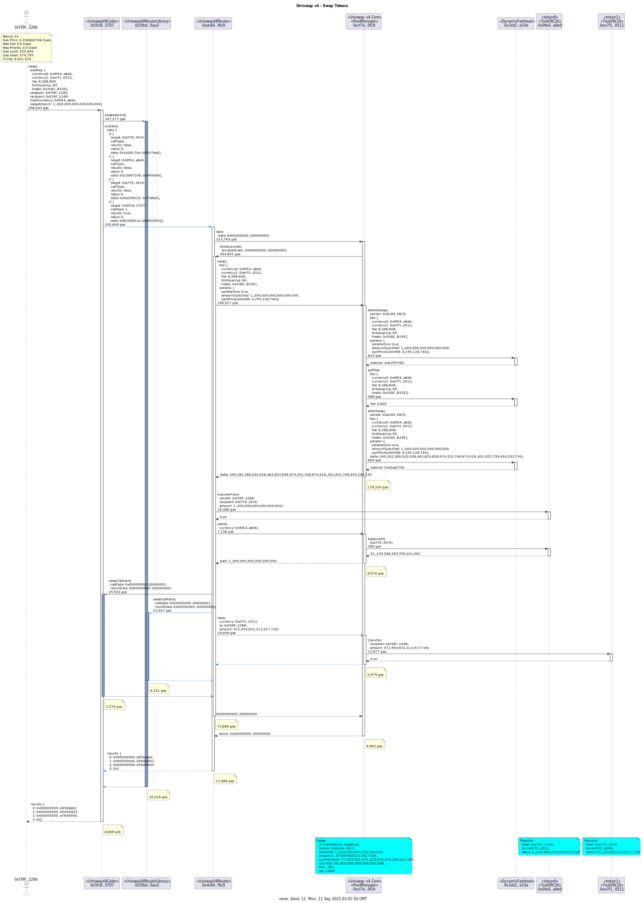
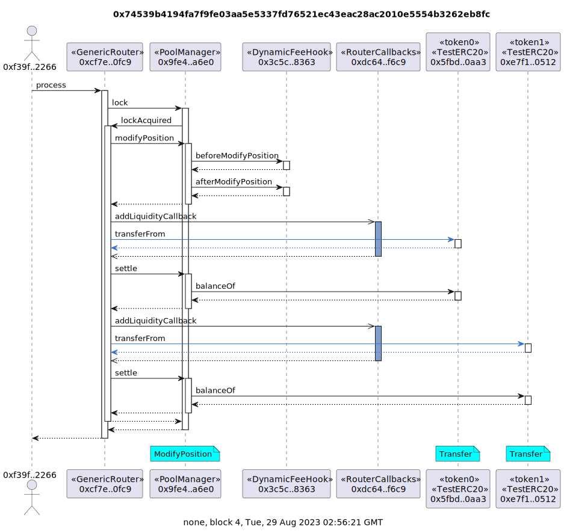
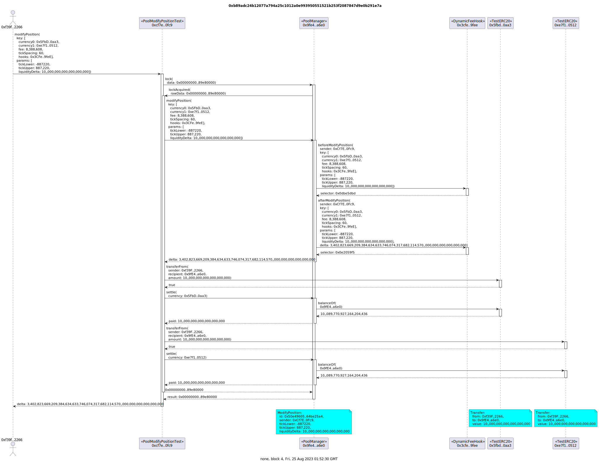
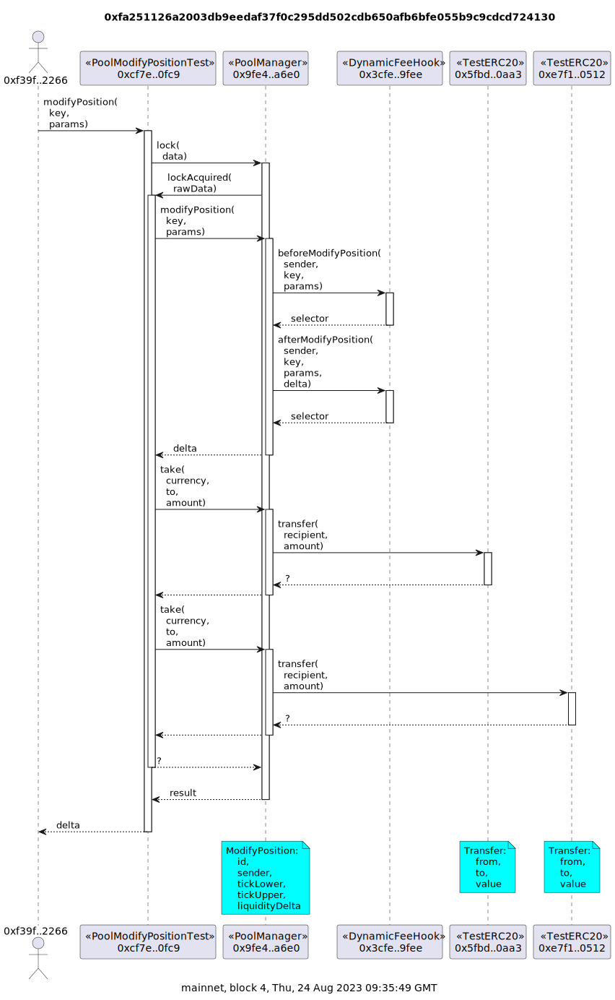
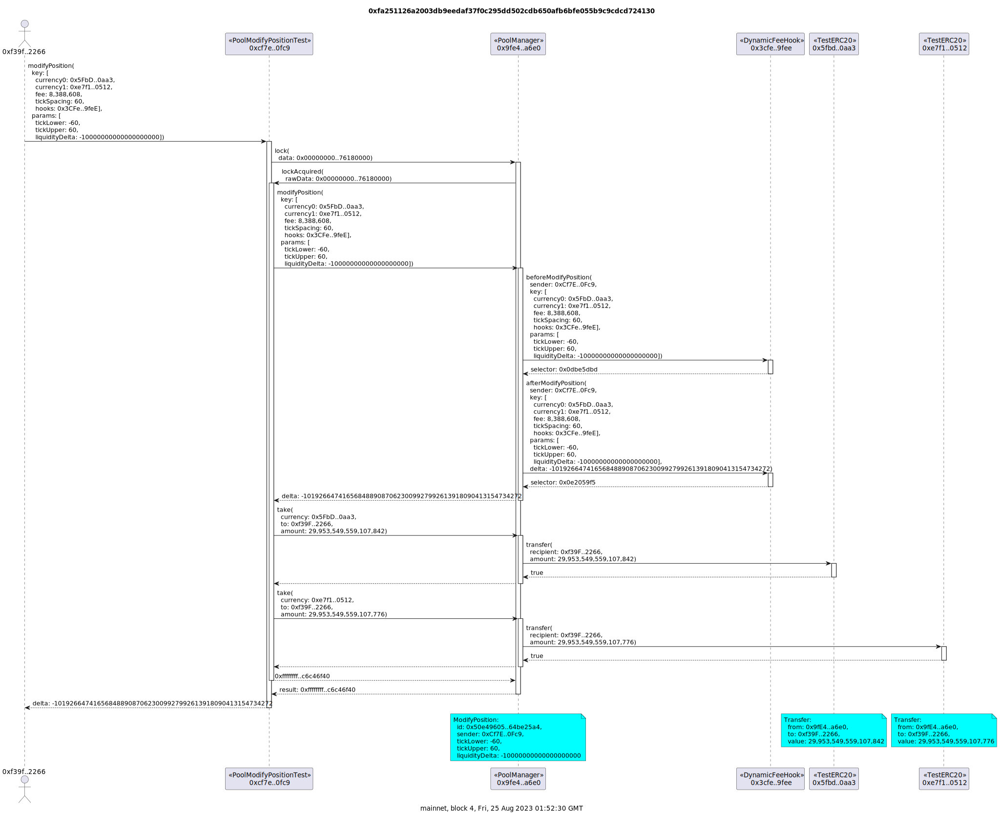

# Example Uniswap v4 Transactions

## Counter Hook

### CounterHook Contract


```
sol2uml class ../src,../lib -b CounterHook
```

### Pool Setup

Deploy a `CounterHook` contract via the `CounterFactory` and initialize a new Uniswap v4 pool using the hook.



```
tx2uml --nodeType anvil --configFile counter.config.json --chain none -t -g -v \
    --noAddresses 0x000000000000000000636f6e736f6c652e6c6f67 \
    0x3f17825b8fe0d777f7ddf35ee512a9258ef1234869bcf02f715ebd9f4af28358,0x3e8aa6240dfe1302a385bafc15dec04bf11322723d5a7a180e47fd0095a090a1 \
    -o counterSetup
```

### Add Liquidity to Pool


```
tx2uml --nodeType anvil --configFile counter.config.json --chain none -p -g -t -v \
    0x834f3d9c9817753ee9e6fecbb10680ceb912d3a2ea7b84010488886600091d22 \
    -o counterModifySummary
```


```
tx2uml --nodeType anvil --configFile counter.config.json --chain none -g -t -v \
    0x834f3d9c9817753ee9e6fecbb10680ceb912d3a2ea7b84010488886600091d22 \
    -o counterModifyDetailed
```

### Swap


```
tx2uml --nodeType anvil --configFile counter.config.json --chain none -p -g -t -v  \
    0x76f7a801d8f2240a93b754891a5da8ce855a9e6e0bada535d2a77556720bcc75 \
    -o counterSwapSummary
```


```
tx2uml --nodeType anvil --configFile counter.config.json --chain none -g -t -v \
    --noAddresses 0x5FbDB2315678afecb367f032d93F642f64180aa3 \
    0x76f7a801d8f2240a93b754891a5da8ce855a9e6e0bada535d2a77556720bcc75 \
    -o counterSwapDetailed
```

### DynamicFeeHook Contract


```
sol2uml class ../src,../lib -b DynamicFeeHook
```

### Swap


```
tx2uml --nodeType anvil --configFile dynamicFee.config.json --chain none -p -g -t -v \
    0xb54aa9311e8030b76f6356bd4bf2d1f7cf5fc1f94b98b6dff49bbf701e6e04e0 \
    -o dynamicFeeSwapSummary
```



```
tx2uml --nodeType anvil --configFile dynamicFee.config.json --chain none -g -t -v \
    0xb54aa9311e8030b76f6356bd4bf2d1f7cf5fc1f94b98b6dff49bbf701e6e04e0 \
    -o dynamicFeeSwapDetailed
```

## Deposit



```
tx2uml --nodeType anvil --configFile dynamicFee.config.json --chain none -p -g -t -v \
    0x74539b4194fa7f9fe03aa5e5337fd76521ec43eac28ac2010e5554b3262eb8fc \
    -o dynamicFeeDepositSummary
```



```
tx2uml --nodeType anvil --configFile dynamicFee.config.json --chain none -g -t -v \
    0x74539b4194fa7f9fe03aa5e5337fd76521ec43eac28ac2010e5554b3262eb8fc \
    -o dynamicFeeDepositDetailed
```

## Withdraw



```
tx2uml --nodeType anvil --configFile dynamicFee.config.json --chain none -p -g -t -v 0x58f377de805864a0d355eade323de8c65ebfbd1c1cf4072934612e102fed3328 -o dynamicFeeWithdrawSummary
```



```
tx2uml --nodeType anvil --configFile dynamicFee.config.json --chain none -g -t -v 0x58f377de805864a0d355eade323de8c65ebfbd1c1cf4072934612e102fed3328 -o dynamicFeeWithdrawDetailed
```
