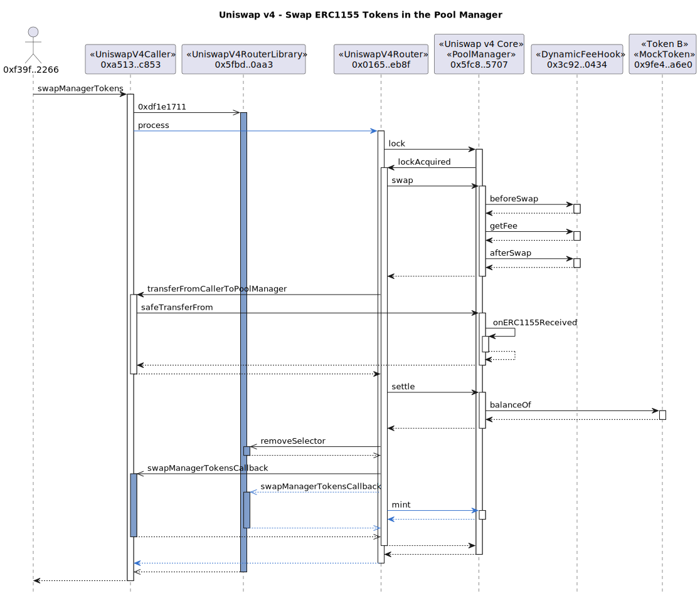

# Example Uniswap v4 Transactions

## Counter Hook

### Pool Setup

Deploy a `CounterHook` contract via the `CounterFactory` and initialize a new Uniswap v4 pool using the hook.


```
tx2uml --nodeType anvil --configFile counter.config.json --chain none -hf -hc -g -t -v \
    --title "Uniswap v4 - Pool Setup" \
    --noAddresses 0x000000000000000000636f6e736f6c652e6c6f67 \
    0xfabb35401132c449e2ef6887892d1e2f43e62480e9f1932aa6c7e8308be7eba5,0xb3ee845923d8f202dd8d4326e87c39d7ee00d2ba341c7794d0f392327ecc41ff \
    -o counterSetup
```

### Add Liquidity to Pool


```
tx2uml --nodeType anvil --configFile counter.config.json --chain none  -hf -hc -p -l -x -g -t -v \
    --title "Uniswap v4 - Add Liquidity to Pool" \
    0xd2d9bcee460447a53dc4fcaed32cf121dcd3cbe730871bbb6d2092913f458145 \
    -o counterModifySummary
```

See the full trace with parameters in [counterModifyDetailed.svg](./counterModifyDetailed.svg)

```
tx2uml --nodeType anvil --configFile counter.config.json --chain none -v \
    --title "Uniswap v4 - Add Liquidity to Pool" \
    0xd2d9bcee460447a53dc4fcaed32cf121dcd3cbe730871bbb6d2092913f458145 \
    -o counterModifyDetailed
```

### Swap


```
tx2uml --nodeType anvil --configFile counter.config.json --chain none \
    --title "Uniswap v4 - Swap token0 for token1" -hf -hc -x -l -p -g -t -v \
    0x6e9c7e4cc12cc0719afa739b776bf95e592146622f2dd755c84c81ff98fd706f \
    -o counterSwapSummary
```

See the full trace with parameters in [counterSwapDetailed.svg](./counterSwapDetailed.svg)

```
tx2uml --nodeType anvil --configFile counter.config.json --chain none \
    --title "Uniswap v4 - Swap token0 for token1" -v \
    0x6e9c7e4cc12cc0719afa739b776bf95e592146622f2dd755c84c81ff98fd706f \
    -o counterSwapDetailed
```

## Dynamic Fee Hook

### Swap tokens using a pool


```
tx2uml --nodeType anvil --configFile dynamicFee.config.json --chain none \
    --title "Uniswap v4 - Swap Tokens" -hf -hc -x -l -p -g -t -v \
    0x623e6894fd8d64ae42534dfcc314aeff0695f5518f818aed295561b068b2af46 \
    -o dynamicFeeSwapSummary
```

See the full trace with parameters in [dynamicFeeSwapDetailed.svg](./dynamicFeeSwapDetailed.svg)

```
tx2uml --nodeType anvil --configFile dynamicFee.config.json --chain none \
    --title "Uniswap v4 - Swap Tokens" -v \
    0x623e6894fd8d64ae42534dfcc314aeff0695f5518f818aed295561b068b2af46 \
    -o dynamicFeeSwapDetailed
```


```
tx2uml value --configFile dynamicFee.config.json --chain none --onlyToken \
    --title "Uniswap v4 - Swap Tokens" -hf -hc -v \
    0x623e6894fd8d64ae42534dfcc314aeff0695f5518f818aed295561b068b2af46 \
    -o dynamicFeeSwapValue
```

### Add liquidity to a pool


```
tx2uml --nodeType anvil --configFile dynamicFee.config.json --chain none \
    --title "Uniswap v4 - Remove Liquidity to a Pool" -hf -hc -x -l -p -g -t -v \
    0xc639b3116391ae4d9ade0ba25bc87d690950c63405fc4d1b37e911f4d4f0b83b \
    -o dynamicFeeAddSummary
```

See the full trace with parameters in [dynamicFeeAddDetailed](./dynamicFeeAddDetailed.svg)

```
tx2uml --nodeType anvil --configFile dynamicFee.config.json --chain none  -v \
    --title "Uniswap v4 - Add Liquidity to a Pool" -v \
    0xc639b3116391ae4d9ade0ba25bc87d690950c63405fc4d1b37e911f4d4f0b83b \
    -o dynamicFeeAddDetailed
```

**Value Flow**


```
tx2uml value --configFile dynamicFee.config.json --chain none --onlyToken \
    --title "Uniswap v4 - Add Liquidity to a Pool" -hf -hc -v \
    0xc639b3116391ae4d9ade0ba25bc87d690950c63405fc4d1b37e911f4d4f0b83b \
    -o dynamicFeeAddValue
```

### Remove liquidity from a pool


```
tx2uml --nodeType anvil --configFile dynamicFee.config.json --chain none \
    --title "Uniswap v4 - Remove Liquidity from a Pool" -hf -hc -x -l -p -g -t -v \
    0xb78d396ea5f8825cb4a895593f084a577407d6c907bf8b33a846e4c341fbf17f -o dynamicFeeRemoveSummary
```

See the full trace with parameters in [dynamicFeeRemoveDetailed.svg](./dynamicFeeRemoveDetailed.svg)

```
tx2uml --nodeType anvil --configFile dynamicFee.config.json --chain none \
    --title "Uniswap v4 - Remove Liquidity from a Pool" -v \
    0xb78d396ea5f8825cb4a895593f084a577407d6c907bf8b33a846e4c341fbf17f \
    -o dynamicFeeRemoveDetailed
```

## Pool Manager

## Deposit tokens into the Pool Manager


```
tx2uml --nodeType anvil --configFile dynamicFee.config.json --chain none \
    --title "Uniswap v4 - Deposit" -hf -hc -x -l -p -g -t -v \
    0x3ab92865b020d566ce9bc52f42f4c96f196b9a0c4329cf74a27e32c1c9f5f352 \
    -o depositSummary
```

See the full trace with parameters in [depositDetailed.svg](./depositDetailed.svg)

```
tx2uml --nodeType anvil --configFile dynamicFee.config.json --chain none \
    --title "Uniswap v4 - Deposit" -v \
    0x3ab92865b020d566ce9bc52f42f4c96f196b9a0c4329cf74a27e32c1c9f5f352 \
    -o depositDetailed
```

## Withdraw tokens from the Pool Manager


```
tx2uml --nodeType anvil --configFile dynamicFee.config.json --chain none \
    --title "Uniswap v4 - Withdraw" -hf -hc -x -l -p -g -t -v \
    0x976339bbf4dfb4145af25029d34fd5a2d5919fa065ad4cb0e34d30907e91b940 \
    -o withdrawSummary
```

See the full trace with parameters in [withdrawDetailed.svg](./withdrawDetailed.svg)

```
tx2uml --nodeType anvil --configFile dynamicFee.config.json --chain none \
    --title "Uniswap v4 - Withdraw" -v \
    0x81ef52fae7c0a4d2421c1caf2d018f45e6ef9c1c0c3a5a13b39a90b8445c8baa,0x976339bbf4dfb4145af25029d34fd5a2d5919fa065ad4cb0e34d30907e91b940 \
    -o withdrawDetailed
```

## Flash loan from the Pool Manager


```
tx2uml --nodeType anvil --configFile dynamicFee.config.json --chain none \
    --title "Uniswap v4 - Flash Loan" -hf -hc -l -p -g -t -v \
    0x26e858c200e5627685aee1bf16e9db98efb1a01ce8b7028218325a32e0d612a7 \
    -o flashLoanSummary
```

See the full trace with parameters in [flashLoanDetailed.svg](./flashLoanDetailed.svg)

```
tx2uml --nodeType anvil --configFile dynamicFee.config.json --chain none \
    --title "Uniswap v4 - Flash Loan" -v \
    0x26e858c200e5627685aee1bf16e9db98efb1a01ce8b7028218325a32e0d612a7 \
    -o flashLoanDetailed
```

## Swap ERC1155 tokens in the Pool Manager



```
tx2uml --nodeType anvil --configFile dynamicFee.config.json --chain none \
    --title "Uniswap v4 - Swap ERC1155 Tokens in the Pool Manager" -hf -hc -l -p -g -t -v \
    0x7357f376a03cbdb2143bacdbdb3768e4c32e3432202921dc612a614eb574d691 \
    -o swapPoolManagerTokensSummary
```

See the full trace with parameters in [swapPoolManagerTokensDetailed.svg](./swapPoolManagerTokensDetailed.svg)

```
tx2uml --nodeType anvil --configFile dynamicFee.config.json --chain none \
    --title "Uniswap v4 - Swap ERC1155 Tokens in the Pool Manager" -v \
    0x7357f376a03cbdb2143bacdbdb3768e4c32e3432202921dc612a614eb574d691 \
    -o swapPoolManagerTokensDetailed
```

<!-- 
tx2uml needs to support ERC1155 transfers


```
tx2uml value --configFile dynamicFee.config.json --chain none --onlyToken \
    --title "Uniswap v4 - Swap ERC1155 Tokens in the Pool Manager" -hf -hc -v \
    0xd9058df9bde86f5b7254d903ca45f93671f08c45c454ab914322bc577bb1de17 \
    -o swapPoolManagerTokensValue
``` -->