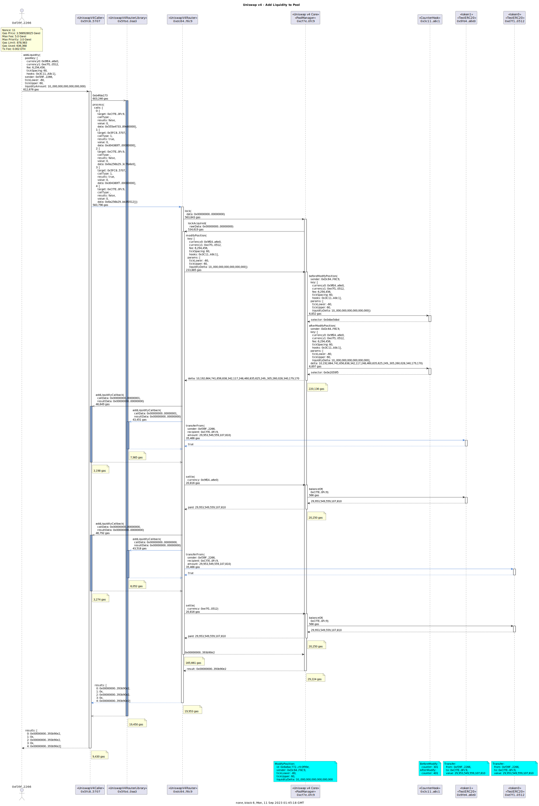

# Example Uniswap v4 Transactions

## Counter Hook

### CounterHook Contract


```
sol2uml class ../src,../lib -b CounterHook
```

<!-- ### Pool Setup

[Counter Swap](./counterSwap.svg)

```
tx2uml --nodeType anvil --configFile counter.config.json -t -l -g -v 0x9cf249890694687e28f66952c3a0469e9150dc788c2a4983ba7e373433270c44,0xc1756dfb5669fe320edb26f99150f836448b07aed75b453604fe3af20ba97e72,0x02ff4b04a82193eba7247358a09a1d0630159a0e54d946d1d45a10dff6ce3388 -o counterSetup
``` -->

### Modify Liquidity


```
tx2uml --nodeType anvil --configFile counter.config.json -p -l -g -t -v 0x9b115c369b25d6ec3a0496ac1b851de7446d08d69e47361cf096912328a85730 -o counterModifySummary
```



```
tx2uml --nodeType anvil --configFile counter.config.json -g -t -v 0x9b115c369b25d6ec3a0496ac1b851de7446d08d69e47361cf096912328a85730 -o counterModifyDetailed
```

### Swap


```
tx2uml --nodeType anvil --configFile counter.config.json -p -l -g -t -v 0x3b1c9480838e66bb5b49ee814ef6bed474244ad69b452a03d04452f803cd560c -o counterSwapSummary
```


```
tx2uml --nodeType anvil --configFile counter.config.json -g -t -v 0x3b1c9480838e66bb5b49ee814ef6bed474244ad69b452a03d04452f803cd560c -o counterSwapDetailed
```
