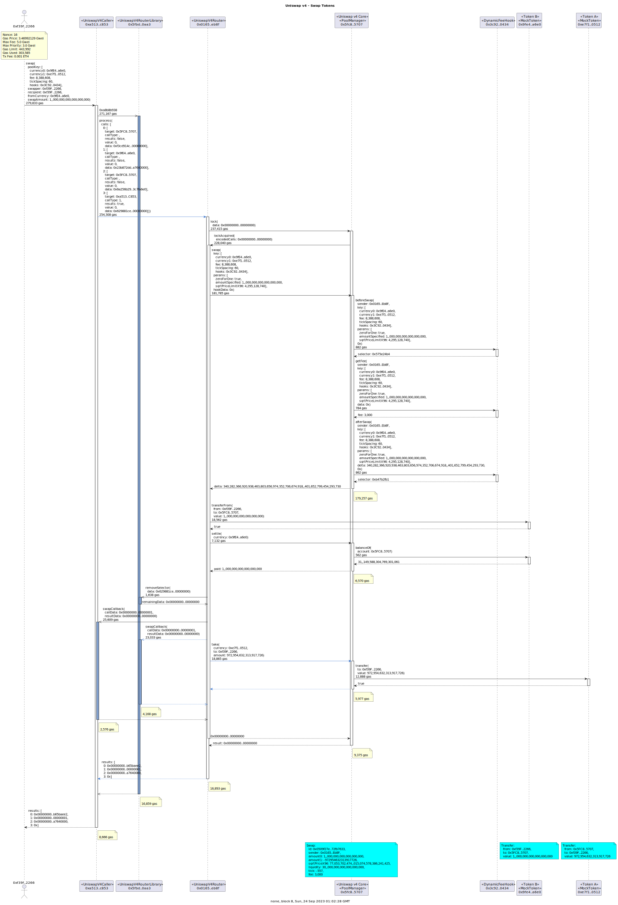

# Example Uniswap v4 Transactions

## Counter Hook

### CounterHook Contract


```
sol2uml class ../src,../lib -b CounterHook
```

### Pool Setup

Deploy a `CounterHook` contract via the `CounterFactory` and initialize a new Uniswap v4 pool using the hook.


```
tx2uml --nodeType anvil --configFile counter.config.json -t -l -g -v 0xaf292eedd8b6188bd7fa91efccfe337b820d2526f34966853baf03dc58e97fbd,0x48c4082ffe451e41c9cbaeb0ff77867e498af1a94175e1fcf5115538783535ca -o counterSetup
```

### Modify Liquidity


```
tx2uml --nodeType anvil --configFile counter.config.json -pv -l -g -t -v 0xedad69b97461dc5bb65e6ec01cc35b47cc5e1c410d87a1c96c648fad8b81b1e8 -o counterModifySummary
```


```
tx2uml --nodeType anvil --configFile counter.config.json -g -t -v 0xedad69b97461dc5bb65e6ec01cc35b47cc5e1c410d87a1c96c648fad8b81b1e8 -o counterModifyDetailed
```

### Swap


```
tx2uml --nodeType anvil --configFile counter.config.json -pv -l -g -t -v 0x8bf2dcb4a75e71fdda9139fe0539ba22bcfe0dcb31e41559897b7e20d440beb1 -o counterSwapSummary
```


```
tx2uml --nodeType anvil --configFile counter.config.json -g -t -v 0x8bf2dcb4a75e71fdda9139fe0539ba22bcfe0dcb31e41559897b7e20d440beb1 -o counterSwapDetailed
```

### DynamicFeeHook Contract


```
sol2uml class ../src,../lib -b DynamicFeeHook
```

### Swap


```
tx2uml --nodeType anvil --configFile dynamicFee.config.json -pv -l -g -t -v 0x3308a33a04fd35a176026c3a68f264baca83a0e2f151838b7f1291170463a049 -o dynamicFeeSwapSummary
```



```
tx2uml --nodeType anvil --configFile dynamicFee.config.json -g -t -v 0x3308a33a04fd35a176026c3a68f264baca83a0e2f151838b7f1291170463a049 -o dynamicFeeSwapDetailed
```
