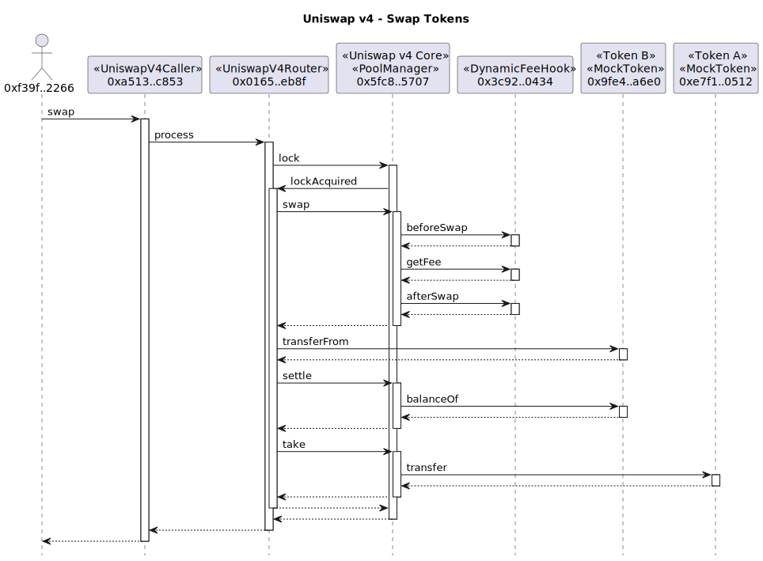

# Example Uniswap v4 Transactions

## Counter Hook

### CounterHook Contract


```
sol2uml class ../src,../lib -b CounterHook
```

<!-- ### Pool Setup

[Counter Swap](./counterSwap.svg)

```
tx2uml --nodeType anvil --configFile counter.config.json -t -l -g -v 0x9cf249890694687e28f66952c3a0469e9150dc788c2a4983ba7e373433270c44,0xc1756dfb5669fe320edb26f99150f836448b07aed75b453604fe3af20ba97e72,0x02ff4b04a82193eba7247358a09a1d0630159a0e54d946d1d45a10dff6ce3388 -o counterSetup
``` -->

### Modify Liquidity


```
tx2uml --nodeType anvil --configFile counter.config.json -pv -l -g -t -v 0xedad69b97461dc5bb65e6ec01cc35b47cc5e1c410d87a1c96c648fad8b81b1e8 -o counterModifySummary
```


```
tx2uml --nodeType anvil --configFile counter.config.json -g -t -v 0xedad69b97461dc5bb65e6ec01cc35b47cc5e1c410d87a1c96c648fad8b81b1e8 -o counterModifyDetailed
```

### Swap


```
tx2uml --nodeType anvil --configFile counter.config.json -pv -l -g -t -v 0x8bf2dcb4a75e71fdda9139fe0539ba22bcfe0dcb31e41559897b7e20d440beb1 -o counterSwapSummary
```


```
tx2uml --nodeType anvil --configFile counter.config.json -g -t -v 0x8bf2dcb4a75e71fdda9139fe0539ba22bcfe0dcb31e41559897b7e20d440beb1 -o counterSwapDetailed
```


### DynamicFeeHook Contract


```
sol2uml class ../src,../lib -b DynamicFeeHook
```

### Swap



```
tx2uml --nodeType anvil --configFile dynamicFee.config.json -pv -l -g -t -v 0x3308a33a04fd35a176026c3a68f264baca83a0e2f151838b7f1291170463a049 -o dynamicFeeSwapSummary
```


```
tx2uml --nodeType anvil --configFile dynamicFee.config.json -g -t -v 0x3308a33a04fd35a176026c3a68f264baca83a0e2f151838b7f1291170463a049 -o dynamicFeeSwapDetailed
```
