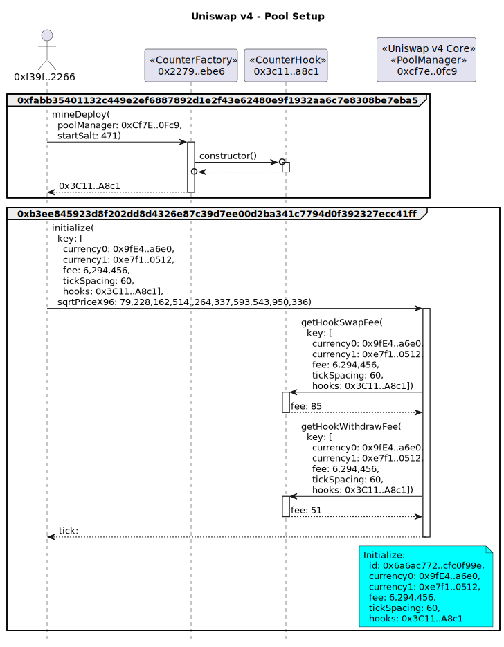
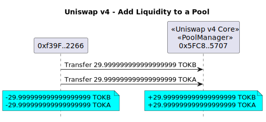
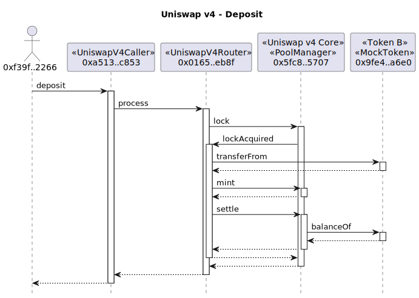
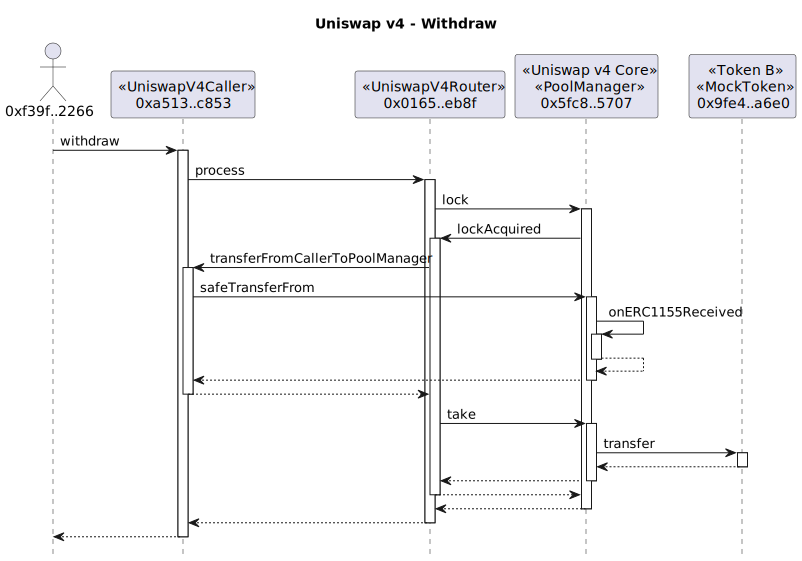

# Example Uniswap v4 Transactions

## Counter Hook

### Pool Setup

Deploy a `CounterHook` contract via the `CounterFactory` and initialize a new Uniswap v4 pool using the hook.



```
tx2uml --nodeType anvil --configFile counter.config.json --chain none -hf -hc -g -t -v \
    --title "Uniswap v4 - Pool Setup" \
    --noAddresses 0x000000000000000000636f6e736f6c652e6c6f67 \
    0xfabb35401132c449e2ef6887892d1e2f43e62480e9f1932aa6c7e8308be7eba5,0xb3ee845923d8f202dd8d4326e87c39d7ee00d2ba341c7794d0f392327ecc41ff \
    -o counterSetup
```

### Add Liquidity to Pool


```
tx2uml --nodeType anvil --configFile counter.config.json --chain none  -hf -hc -p -l -x -g -t -v \
    --title "Uniswap v4 - Add Liquidity to Pool" \
    0xd2d9bcee460447a53dc4fcaed32cf121dcd3cbe730871bbb6d2092913f458145 \
    -o counterModifySummary
```

See the full trace with parameters in [counterModifyDetailed.svg](./counterModifyDetailed.svg)

```
tx2uml --nodeType anvil --configFile counter.config.json --chain none -v \
    --title "Uniswap v4 - Add Liquidity to Pool" \
    0xd2d9bcee460447a53dc4fcaed32cf121dcd3cbe730871bbb6d2092913f458145 \
    -o counterModifyDetailed
```

### Swap


```
tx2uml --nodeType anvil --configFile counter.config.json --chain none \
    --title "Uniswap v4 - Swap token0 for token1" -hf -hc -x -l -p -g -t -v \
    0x6e9c7e4cc12cc0719afa739b776bf95e592146622f2dd755c84c81ff98fd706f \
    -o counterSwapSummary
```

See the full trace with parameters in [counterSwapDetailed.svg](./counterSwapDetailed.svg)

```
tx2uml --nodeType anvil --configFile counter.config.json --chain none \
    --title "Uniswap v4 - Swap token0 for token1" -v \
    0x6e9c7e4cc12cc0719afa739b776bf95e592146622f2dd755c84c81ff98fd706f \
    -o counterSwapDetailed
```

## Dynamic Fee Hook

### Swap tokens using a pool


```
tx2uml --nodeType anvil --configFile dynamicFee.config.json --chain none \
    --title "Uniswap v4 - Swap Tokens" -hf -hc -x -l -p -g -t -v \
    0x3ed0c0719da01688328b48231566ff10d27ddc07d937bffd84fa926de27ed765 \
    -o dynamicFeeSwapSummary
```

See the full trace with parameters in [dynamicFeeSwapDetailed.svg](./dynamicFeeSwapDetailed.svg)

```
tx2uml --nodeType anvil --configFile dynamicFee.config.json --chain none \
    --title "Uniswap v4 - Swap Tokens" -v \
    0x3ed0c0719da01688328b48231566ff10d27ddc07d937bffd84fa926de27ed765 \
    -o dynamicFeeSwapDetailed
```

**Value Flows**


```
tx2uml value --configFile dynamicFee.config.json --chain none --onlyToken \
    --title "Uniswap v4 - Swap Tokens" -hf -hc -v \
    0x3ed0c0719da01688328b48231566ff10d27ddc07d937bffd84fa926de27ed765 \
    -o dynamicFeeSwapValue
```

### Add liquidity to a pool


```
tx2uml --nodeType anvil --configFile dynamicFee.config.json --chain none \
    --title "Uniswap v4 - Remove Liquidity to a Pool" -hf -hc -x -l -p -g -t -v \
    0x8a288170cf4f7f37e478597208843dda7fa2fcfe852dc94b5f4d9a36b0bfd278 \
    -o dynamicFeeAddSummary
```

See the full trace with parameters in [dynamicFeeAddDetailed](./dynamicFeeAddDetailed.svg)

```
tx2uml --nodeType anvil --configFile dynamicFee.config.json --chain none  -v \
    --title "Uniswap v4 - Add Liquidity to a Pool" -v \
    0x8a288170cf4f7f37e478597208843dda7fa2fcfe852dc94b5f4d9a36b0bfd278 \
    -o dynamicFeeAddDetailed
```

**Value Flows**



```
tx2uml value --configFile dynamicFee.config.json --chain none --onlyToken \
    --title "Uniswap v4 - Add Liquidity to a Pool" -hf -hc -v \
    0x8a288170cf4f7f37e478597208843dda7fa2fcfe852dc94b5f4d9a36b0bfd278 \
    -o dynamicFeeAddValue
```

### Remove liquidity from a pool


```
tx2uml --nodeType anvil --configFile dynamicFee.config.json --chain none \
    --title "Uniswap v4 - Remove Liquidity from a Pool" -hf -hc -x -l -p -g -t -v \
    0x8d14ff42b04de11964541401a5c13de22530e704e8a0661c7c00703ed3153c16 -o dynamicFeeRemoveSummary
```

See the full trace with parameters in [dynamicFeeRemoveDetailed.svg](./dynamicFeeRemoveDetailed.svg)

```
tx2uml --nodeType anvil --configFile dynamicFee.config.json --chain none \
    --title "Uniswap v4 - Remove Liquidity from a Pool" -v \
    0x8d14ff42b04de11964541401a5c13de22530e704e8a0661c7c00703ed3153c16 \
    -o dynamicFeeRemoveDetailed
```

**Value Flows**


```
tx2uml value --configFile dynamicFee.config.json --chain none --onlyToken \
    --title "Uniswap v4 - Remove Liquidity to a Pool" -hf -hc -v \
    0x8d14ff42b04de11964541401a5c13de22530e704e8a0661c7c00703ed3153c16 \
    -o dynamicFeeRemoveValue
```

## Pool Manager

## Deposit tokens into the Pool Manager



```
tx2uml --nodeType anvil --configFile dynamicFee.config.json --chain none \
    --title "Uniswap v4 - Deposit" -hf -hc -x -l -p -g -t -v \
    0xbecdfe032eb2b73ff63d3406e9669e5270e85955a459a5f0d7f1cf1c61f85be2 \
    -o depositSummary
```

See the full trace with parameters in [depositDetailed.svg](./depositDetailed.svg)

```
tx2uml --nodeType anvil --configFile dynamicFee.config.json --chain none \
    --title "Uniswap v4 - Deposit" -v \
    0xbecdfe032eb2b73ff63d3406e9669e5270e85955a459a5f0d7f1cf1c61f85be2 \
    -o depositDetailed
```

**Value Flows**


```
tx2uml value --configFile dynamicFee.config.json --chain none --onlyToken \
    --title "Uniswap v4 - Deposit Value Transfers" -hf -hc -v \
    0xbecdfe032eb2b73ff63d3406e9669e5270e85955a459a5f0d7f1cf1c61f85be2 \
    -o depositValue
```

## Withdraw tokens from the Pool Manager



```
tx2uml --nodeType anvil --configFile dynamicFee.config.json --chain none \
    --title "Uniswap v4 - Withdraw" -hf -hc -x -l -p -g -t -v \
    0x96939ca613e425db4493a7b70a81056e1dadcf81023216b404a2adc7c4a3ff30 \
    -o withdrawSummary
```

See the full trace with parameters in [withdrawDetailed.svg](./withdrawDetailed.svg)

```
tx2uml --nodeType anvil --configFile dynamicFee.config.json --chain none \
    --title "Uniswap v4 - Withdraw" -v \
    0x82da8e1120dcbc236d3b603db357923c8cc3691711a67fe259f3404c6ba23ad5,0x96939ca613e425db4493a7b70a81056e1dadcf81023216b404a2adc7c4a3ff30 \
    -o withdrawDetailed
```
**Value Flows**


```
tx2uml value --configFile dynamicFee.config.json --chain none --onlyToken \
    --title "Uniswap v4 - Withdraw Value Transfers" -hf -hc -v \
    0x96939ca613e425db4493a7b70a81056e1dadcf81023216b404a2adc7c4a3ff30 \
    -o withdrawValue
```

## Flash loan from the Pool Manager


```
tx2uml --nodeType anvil --configFile dynamicFee.config.json --chain none \
    --title "Uniswap v4 - Flash Loan" -hf -hc -l -p -g -t -v \
    0x07f869c4a03292803b15b97cc812bb7cb05f6e587b84889c880da69671ec37d4 \
    -o flashLoanSummary
```

See the full trace with parameters in [flashLoanDetailed.svg](./flashLoanDetailed.svg)

```
tx2uml --nodeType anvil --configFile dynamicFee.config.json --chain none \
    --title "Uniswap v4 - Flash Loan" -v \
    0x07f869c4a03292803b15b97cc812bb7cb05f6e587b84889c880da69671ec37d4 \
    -o flashLoanDetailed
```

## Swap ERC1155 tokens in the Pool Manager


```
tx2uml --nodeType anvil --configFile dynamicFee.config.json --chain none \
    --title "Uniswap v4 - Swap ERC1155 Tokens in the Pool Manager" -hf -hc -l -p -g -t -v \
    0x0d9980ebc2c1a15ec8cd8100365829af3d5baa75fea4fef66315c1f9163f7abc \
    -o swapPoolManagerTokensSummary
```

See the full trace with parameters in [swapPoolManagerTokensDetailed.svg](./swapPoolManagerTokensDetailed.svg)

```
tx2uml --nodeType anvil --configFile dynamicFee.config.json --chain none \
    --title "Uniswap v4 - Swap ERC1155 Tokens in the Pool Manager" -v \
    0x0d9980ebc2c1a15ec8cd8100365829af3d5baa75fea4fef66315c1f9163f7abc \
    -o swapPoolManagerTokensDetailed
```

Value transfers


```
tx2uml value --configFile dynamicFee.config.json --chain none --onlyToken \
    --title "Uniswap v4 - Swap ERC1155 Tokens in the Pool Manager" -hf -hc -v \
    0x0d9980ebc2c1a15ec8cd8100365829af3d5baa75fea4fef66315c1f9163f7abc \
    -o swapPoolManagerTokensValue
```
