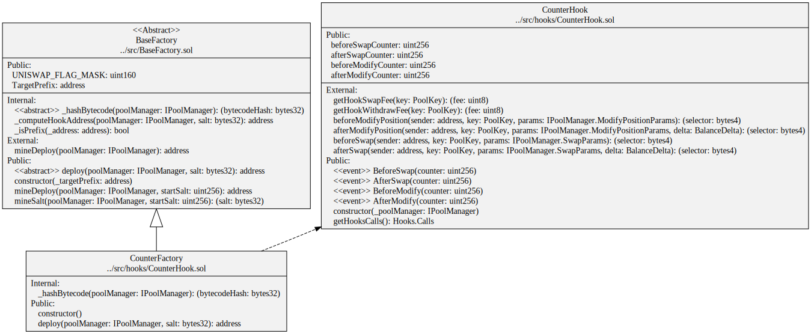
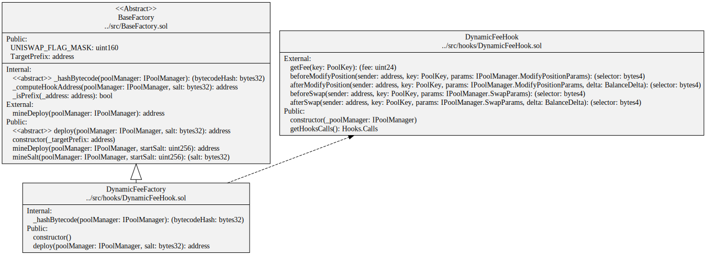
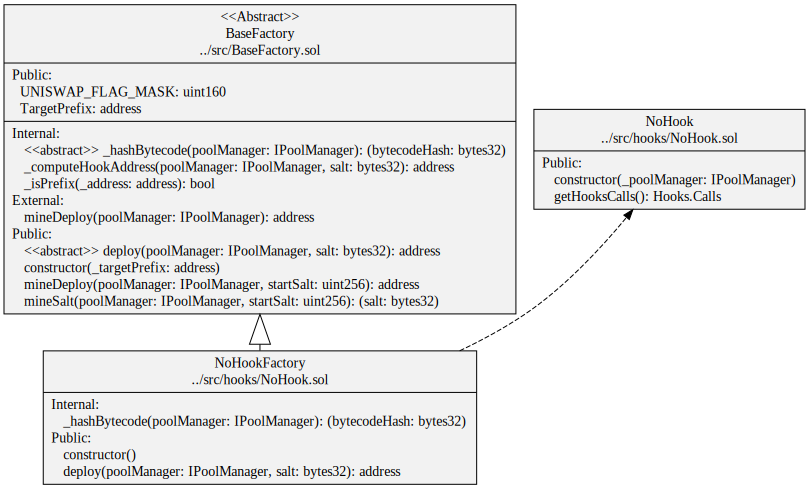

## CounterHook Contract



```
sol2uml class ../src,../lib -b CounterFactory
```

## DynamicFeeHook Contract



```
sol2uml class ../src,../lib -b DynamicFeeFactory
```

## NoHook Contract



```
sol2uml class ../src,../lib -b NoHookFactory
```


