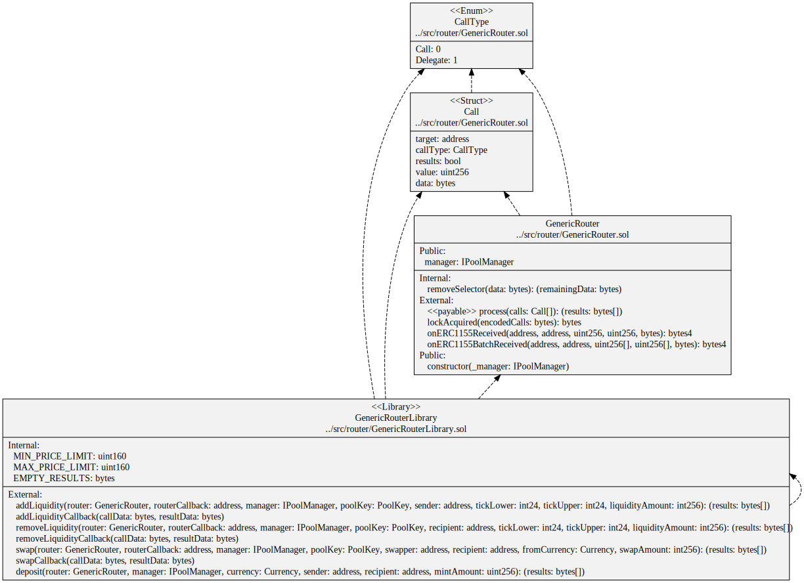

# Generic Router for Uniswap v4

- [GenericRouter](./GenericRouter.sol) a Uniswap v4 router that takes an array of generic calls that will be executed after getting a lock from the Uniswap PoolManager. The calls can be to the `PoolManager`, eg ` modifyPosition``,  `swap`` , `settle `` or `take`. Or they can be to any other contract, eg a token transfer. The calls can optionally be delegated. They can also include the results of all the calls executed so far so callbacks can get `BalanceDelta` data from earlier `swap` or `modifyPosition` calls.

- [GenericRouterLibrary](./GenericRouterLibrary.sol) a library of Uniswap v4 operations. eg `addLiquidity` to a pool, `removingLiquidity` from a pool, `swap` tokens using a pool or `deposit` tokens to the pool manager.

See the [docs README](../../docs/README.md) for example transactions that use the `GenericRouter`.



```
sol2uml class ../src,../lib -b GenericRouterLibrary
```
