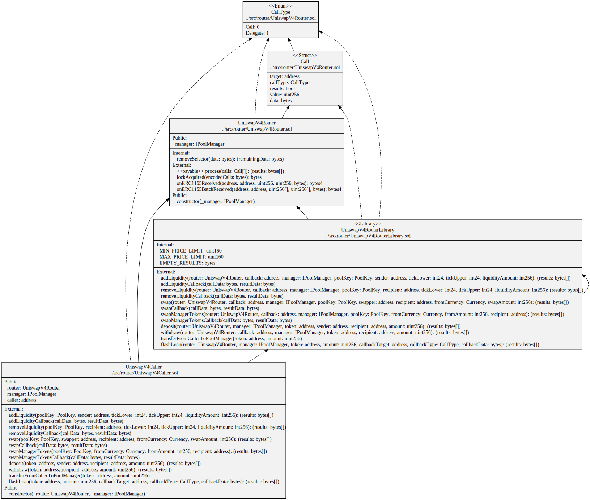

# Generic Router for Uniswap v4

- [UniswapV4Router](./UniswapV4Router.sol) a Uniswap v4 router that takes an array of generic calls that will be executed after getting a lock from the Uniswap PoolManager. The calls can be to the `PoolManager`, eg `modifyPosition`, `swap` , `settle`, `take`, `mint`, `safeTransfer` or `safeTransferFrom`. Or they can be to any other contract, eg a token transfer. The calls can optionally be delegated. They can also include the results of all the calls executed so far so callbacks can get `BalanceDelta` data from earlier `swap` or `modifyPosition` calls.

- [UniswapV4Caller](./UniswapV4Caller.sol) a helper contract that constructs common Uniswap v4 operations for the UniswapV4Router. eg `addLiquidity` to a pool, `removeLiquidity` from a pool, `swap` tokens using a pool, `deposit` tokens to the pool manager, `withdraw` tokens from the pool manager or process a flash loan. Also includes callback functions used by the add, remove and swap operations. User can not delegate directly to the `UniswapV4RouterLibrary` so this contract serves as a wrapper.

- [UniswapV4RouterLibrary](./UniswapV4RouterLibrary.sol) is a library with all the logic for the Uniswap v4 operations.

See the [docs README](../../docs/README.md) for example transactions that use the `UniswapV4Router`.



```
sol2uml class ../src,../lib -b UniswapV4Router,UniswapV4RouterLibrary,UniswapV4Caller -o UniswapV4Router.svg
```
